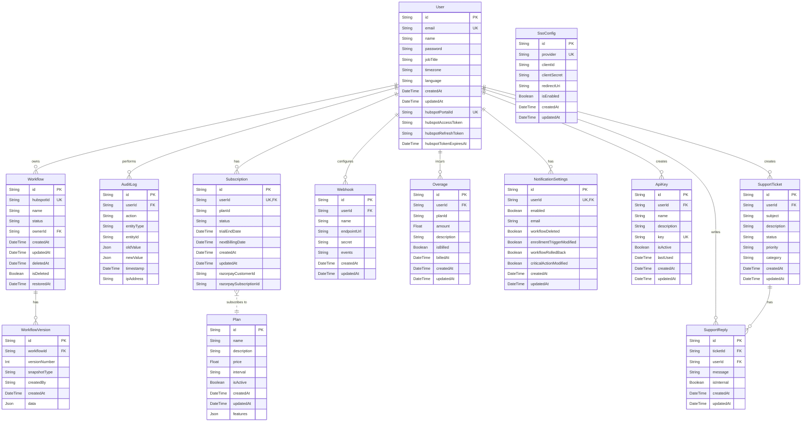

# Database Schema Analysis

## 1. Overview

The database schema is defined using Prisma and is designed to support the core features of the WorkflowGuard application. It uses a PostgreSQL database and includes tables for managing users, workflows, subscriptions, and other application-related data.

## 2. ERD Diagram

## 3. Table Descriptions

### `User`
- **Purpose:** Stores user account information, including authentication details and HubSpot integration credentials.
- **Key Columns:**
  - `id`: Unique identifier for the user.
  - `email`: User's email address (unique).
  - `hubspotPortalId`: HubSpot portal ID associated with the user's account.

### `Workflow`
- **Purpose:** Represents a HubSpot workflow being monitored by the application.
- **Key Columns:**
  - `id`: Unique identifier for the workflow.
  - `hubspotId`: The ID of the workflow in HubSpot (unique).
  - `ownerId`: Foreign key linking to the `User` who owns the workflow.

### `WorkflowVersion`
- **Purpose:** Stores snapshots of a workflow at different points in time.
- **Key Columns:**
  - `id`: Unique identifier for the version.
  - `workflowId`: Foreign key linking to the `Workflow`.
  - `versionNumber`: Sequential version number for each workflow.
  - `data`: JSON object containing the workflow snapshot.

### `AuditLog`
- **Purpose:** Tracks significant actions performed by users within the application.
- **Key Columns:**
  - `id`: Unique identifier for the log entry.
  - `userId`: Foreign key linking to the `User` who performed the action.
  - `action`: The action that was performed (e.g., "workflow.create").
  - `newValue`: JSON object representing the state of the entity after the change.

### `Subscription`
- **Purpose:** Manages user subscriptions and billing information.
- **Key Columns:**
  - `id`: Unique identifier for the subscription.
  - `userId`: Foreign key linking to the `User`.
  - `planId`: The ID of the subscription plan.
  - `razorpaySubscriptionId`: The subscription ID from Razorpay.

### `Webhook`
- **Purpose:** Stores configurations for webhooks that send notifications to external services.
- **Key Columns:**
  - `id`: Unique identifier for the webhook.
  - `userId`: Foreign key linking to the `User`.
  - `endpointUrl`: The URL where the webhook payload will be sent.

### `Plan`
- **Purpose:** Defines the available subscription plans.
- **Key Columns:**
  - `id`: Unique identifier for the plan.
  - `name`: The name of the plan (e.g., "Basic", "Pro").
  - `price`: The price of the plan.

### `Overage`
- **Purpose:** Tracks any usage that exceeds the limits of a user's subscription plan.
- **Key Columns:**
  - `id`: Unique identifier for the overage record.
  - `userId`: Foreign key linking to the `User`.
  - `amount`: The overage amount to be billed.

### `NotificationSettings`
- **Purpose:** Stores user preferences for receiving notifications.
- **Key Columns:**
  - `id`: Unique identifier for the settings.
  - `userId`: Foreign key linking to the `User`.
  - `workflowDeleted`: Boolean flag to enable/disable notifications for workflow deletions.

### `ApiKey`
- **Purpose:** Manages API keys for programmatic access to the application.
- **Key Columns:**
  - `id`: Unique identifier for the API key.
  - `userId`: Foreign key linking to the `User`.
  - `key`: The API key string (unique).

### `SsoConfig`
- **Purpose:** Stores configurations for Single Sign-On (SSO) providers.
- **Key Columns:**
  - `id`: Unique identifier for the SSO configuration.
  - `provider`: The SSO provider (e.g., "google", "okta").

### `SupportTicket` & `SupportReply`
- **Purpose:** A simple support ticket system to manage user inquiries.
- **Key Columns:**
  - `SupportTicket`: Stores the main ticket information.
  - `SupportReply`: Stores replies to a support ticket.